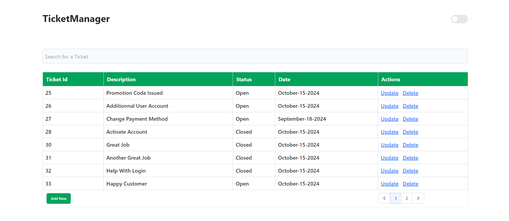
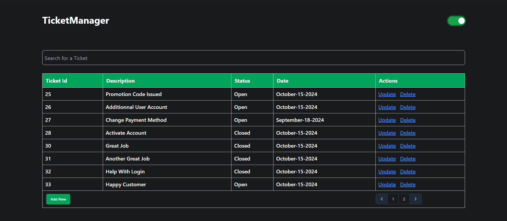
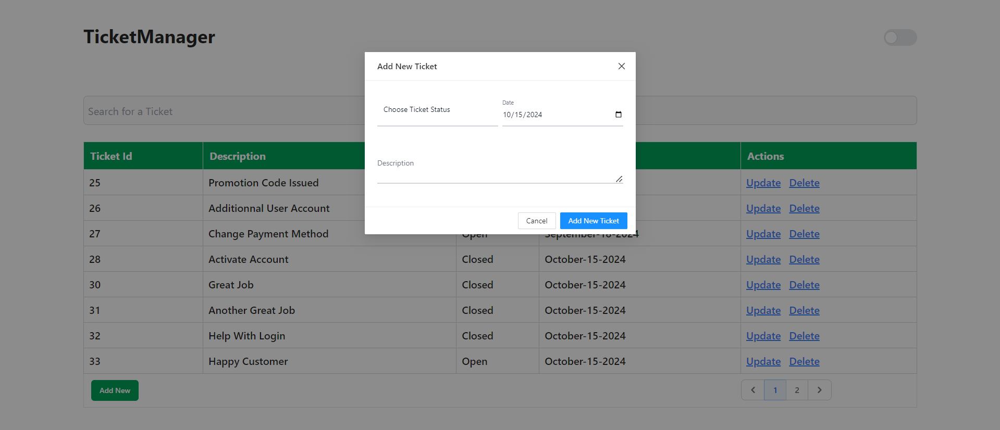
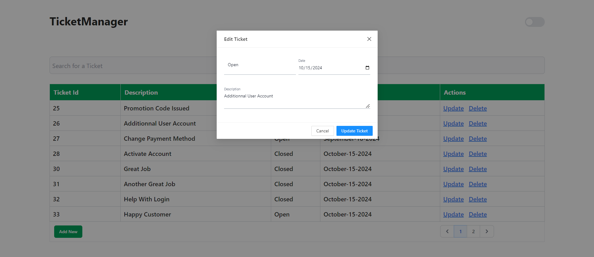
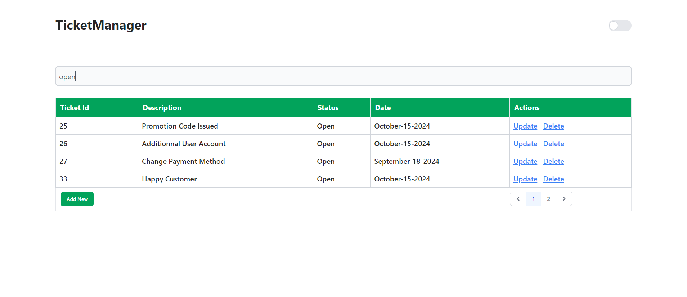

# TicketManager

This project was generated with [Angular CLI](https://github.com/angular/angular-cli) version 17.3.2.

### Project Overview 
This web application is designed to manage tickets, providing essential CRUD (Create, Read, Update, Delete) functionality using a modern tech stack. The backend is powered by .NET 8, while the frontend is developed using Angular  TypeScript for a robust, type-safe development experience.

The key features include:

- Ticket Management: Each ticket has a unique identifier, a description, and a status.
- Status Tracking: Tickets can be marked as "Open" or "Closed" based on their progress.
- Creation Date: Each ticket records the date it was created.
- Actions: Users can update or delete tickets directly from the UI.


### Requirements
Before setting up and running this project, ensure you have the following prerequisites installed on your machine:

- **Node.js (version 14.x or later)**: Necessary for the frontend development.
    - [Download Node.js](https://nodejs.org/)

- **Angular CLI (for Angular projects)**: If you're using Angular, install it globally:
  ```bash
  npm install -g @angular/cli

## Installation

To set up the project locally, follow these steps:

1. **Clone the repository**:

   Open a terminal and run the following command to clone the repository to your local machine:

   ```bash
   git clone https://github.com/FouadElMetioui/TicketManager-Angular-Hahn-Software-Test.git

2. **Navigate to the project directory:**
   ```bash
   cd TicketManager 


3. **Install the frontend dependencies:**
   ```bash
   npm install

### Running the Application
- To serve the project locally in development mode, run:

   ```bash
   ng serve
- The application will be available at http://localhost:4200/.
- Use **`ng serve --open`** to automatically open it in the default browser.

### Running the Application


### Dark mode


### Create a new Ticket


### Edit Ticket


### Search Ticket

